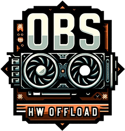

# obs-hw-offload
### A "soft capture card" or: headless NDI® OBS offloading with HW transcoding

[](#)

## Introduction
Ever wondered why you have an Intel CPU with QuickSync capabilities in your network, or a server with an Arc GPU, but you're still using your gaming
machine's resources to transcode your video when streaming?

Are you trying to find a capture card to fit your needs, don't want to compromise on HDMI passthrough, or simply want to use DisplayPort?

You've got an older Laptop with an Intel CPU with an iGPU that's just lying around, not utilized?

This can help. 

The best example would be using [OBS](https://obsproject.com/) with [DistroAV](https://distroav.org/) to send a virtually lossless video/audio stream to the GStreamer or FFMPEG
NDI input, transcoding it using VAAPI, AMF, NVENC and sending it to your RTMP (SRT, RTSP, whatever) target (custom RTMP, Twitch etc.).

E.g.: Distributed, headless OBS encoding/transcoding/streaming, or "soft capture card".

### Note
For now this project is just a container built with the right environment to enable you to do what it claims. At a certain point this is likely to become software, at least to simplify the command line.

## Requirements
* Ideally VAAPI-compatible hardware/driver on host OS (at least something in `/dev/dri*`)
  * NVENC/CUVID/AMF should work as well (untested as of now; possibly only active in `big` builds)
  * To use an NVIDIA card you need the correct container parameters (such as `runtime=nvidia`)
* Something sending NDI streams, such as OBS DistroAV
* Something to send your stream to (via RTMP, or any other protocol)
* Optional: host networking (only when auto discovery is used)


### Bandwidth
With DistroAV, which still uses NDI SpeedHQ, the following _local_ network bandwidth usage can be expected:
* 1080p60: ~130 Mbit/s
* 2160p60: ~250 Mbit/s

Ref: https://ndi.video/tech/formats/

## Installation
Either:
* [Build](#building) it yourself or
* Get it from [DockerHub](https://hub.docker.com/repository/docker/pannal/obs-hw-offload/general) (see [below](#running))

## Running

* Start OBS (with DistroAV installed)
* Enable Tools > DistroAV NDI Settings > Main Output
* Hit OK
  * _don't_ Start Streaming (not necessary)
  * _don't_ change OBS's color format or it will crash (and it won't work with NDI)

#### List NDI sources
Replace `OBS_COMPUTER_IP` with the PC's IP running OBS DistroAV
###### FFmpeg
###### _Note the left part of `'COMPUTER (OBS)'  'ip:port'` as `NDI_NAME` here_
```
docker run -it --rm --name obs-hw-offload pannal/obs-hw-offload \
  ffmpeg -extra_ips "OBS_COMPUTER_IP" -f libndi_newtek -find_sources 1 -i ""
```

###### GStreamer
###### _Note `ndi-name` as `NDI_NAME` and `url-address` here_
```
docker run -it --init --rm --network=host --env USE_AUTODISCOVERY=true pannal/obs-hw-offload \
  gst-device-monitor-1.0 Source/Network:application/x-ndi
```


### Variable setup
`TARGET` is your streaming target. E.g.: `rtmp://host:port/streamkey`

#### Direct connection (default):
###### FFmpeg
* Use `SOURCE` as `-extra_ips "OBS_COMPUTER_IP" -i "NDI_NAME"` while replacing `OBS_COMPUTER_IP` with the IP of your OBS source host and `NDI_NAME` from the previous step

###### GStreamer
* Use `SOURCE` as `url-address="OBS_COMPUTER_IP:5961"` while replacing `OBS_COMPUTER_IP` with the IP of your OBS source host


#### Autodiscovery (not recommended)
<details><summary>Expand</summary>

Run docker with `--network=host` and `--env USE_AUTODISCOVERY=true`

###### FFmpeg
* Use `SOURCE` as `-i "NDI_NAME"` while replacing `NDI_NAME` with the value from the previous step

###### GStreamer
* Use `SOURCE` as `ndi-name="NDI_NAME"` with the NDI source name from the previous step
</details>

## Streaming
### Stream wrapper on host, using Docker
#### Prerequisite: Get current stream.sh
```
curl -o stream -sLJO "https://raw.githubusercontent.com/pannal/obs-hw-offload/refs/heads/master/scripts/stream.sh" >/dev/null 2>&1
chmod +x stream
./stream --help
```

#### CBR h265 hw-scaled to 1080p, 8mbit, 128kbit AAC, wait for and auto-retry/restart NDI source
```
./stream -n "NDI_NAME" -x "OBS_COMPUTER_IP" -s TARGET -vf "format=nv12,hwupload,scale_vaapi=w=1920:h=1080" -r
```

#### CQP h265 native resolution, native framerate, quality based, 192kbit AAC
```
./stream -n "NDI_NAME" -x "OBS_COMPUTER_IP" --ffmpeg-audio "-c:a libfdk_aac -b:a 192k" --ffmpeg-video \
  "-c:v hevc_vaapi -maxrate 24M -minrate 2M -rc_init_occupancy 90 -global_quality 23 -qmin 10 -qmax 51" -s TARGET -nf
```

### Stream wrapper inside Docker
<details><summary>Expand</summary>

#### CBR h265 hw-scaled to 1080p, 8mbit, 128kbit AAC, wait for and auto-retry/restart NDI source
```
docker run -it --init --rm --name obs-hw-offload --device /dev/dri/renderD128:/dev/dri/renderD128 pannal/obs-hw-offload \
  stream -n "NDI_NAME" -x "OBS_COMPUTER_IP" -s TARGET -vf "format=nv12,hwupload,scale_vaapi=w=1920:h=1080" -r
```

</details>

### Streaming using FFmpeg directly
<details><summary>Expand</summary>

#### QVBR h265 original resolution, high quality, 14mbit (capped at 20mbit)
```
docker run -it --init --rm --name obs-hw-offload --device /dev/dri/renderD128:/dev/dri/renderD128 pannal/obs-hw-offload \
  ffmpeg -fflags nobuffer -hwaccel vaapi -vaapi_device /dev/dri/renderD128 -hwaccel_output_format vaapi \
   -f libndi_newtek -analyzeduration 5M -probesize 50M SOURCE \
   -vf 'format=nv12,hwupload' -c:v hevc_vaapi -maxrate 20M -b:v 14M -qp 20 -rc_mode QVBR -map 0:0 -map 0:1 -c:a libfdk_aac -b:a 128k \
   -f flv TARGET
```

#### CBR h265 hw-scaled to 1080p, 8mbit, 192kbit AAC
```
docker run -it --init --rm --name obs-hw-offload --device /dev/dri/renderD128:/dev/dri/renderD128 pannal/obs-hw-offload \
  ffmpeg -fflags nobuffer -hwaccel vaapi -vaapi_device /dev/dri/renderD128 -hwaccel_output_format vaapi \
   -f libndi_newtek -analyzeduration 5M -probesize 50M SOURCE \
   -vf 'format=nv12,hwupload,scale_vaapi=w=1920:h=1080' -c:v hevc_vaapi -b:v 8M -rc_mode CBR -map 0:0 -map 0:1 -c:a libfdk_aac -b:a 192k \
   -f flv TARGET
```

#### CBR h265 hw-scaled to 1080p, 8mbit, high quality VBR AAC
```
docker run -it --init --rm --name obs-hw-offload --device /dev/dri/renderD128:/dev/dri/renderD128 pannal/obs-hw-offload \
  ffmpeg -fflags nobuffer -hwaccel vaapi -vaapi_device /dev/dri/renderD128 -hwaccel_output_format vaapi \
   -f libndi_newtek -analyzeduration 5M -probesize 50M SOURCE \
   -vf 'format=nv12,hwupload,scale_vaapi=w=1920:h=1080' -c:v hevc_vaapi -b:v 8M -rc_mode CBR -map 0:0 -map 0:1 -c:a libfdk_aac -vbr 4 \
   -f flv TARGET
```

</details>

#### Further reading
* [Available codecs/encoders](#list-encoderscodecs)
* [FFmpeg VAAPI](https://trac.ffmpeg.org/wiki/Hardware/VAAPI)
* [FFmpeg Documentation](https://ffmpeg.org/ffmpeg.html)
* [VAAPI tips](https://gist.github.com/Brainiarc7/95c9338a737aa36d9bb2931bed379219)


### Persistance

###### FFmpeg
Not implemented yet.

###### GStreamer
When we don't receive output from an NDI source for 100s, the container exits. To automatically listen for sources for another 100s, simply add `--restart unless-stopped` to the container run parameters.


### Examples (GStreamer)
<details><summary>Expand</summary>

Note:
* Replace `SOURCE` according to [Variable Setup](#variable-setup)
* Replace `rtmp://your_server/streamkey` with your rtmp target
* Replace the image name `obs-hw-offload` with `pannal/obs-hw-offload` if you want to use the one prebuilt on DockerHub 


### With host-networking, autodiscovery:

#### VBR h264 resize to 1080p, high quality, 12mbit
```docker run -it --rm --name=obs-hw-offload --device /dev/dri/renderD128:/dev/dri/renderD128 pannal/obs-hw-offload gst-launch-1.0 ndisrc SOURCE timeout=100000 connect-timeout=100000 ! ndisrcdemux name=demux demux.video ! videoconvert ! vaapipostproc width=1920 height=1080 ! vaapih264enc rate-control=cbr bitrate=12000 keyframe-period=30 quality-level=2 cabac=true init-qp=36 ! h264parse ! queue ! mux. demux.audio ! audioconvert ! audioresample ! avenc_aac ! queue ! mux. flvmux name=mux streamable=true ! rtmpsink location="rtmp://your_server/streamkey live=1"```

#### CBR h264 original resolution, default quality, 24mbit
```docker run -it --rm --name=obs-hw-offload --device /dev/dri/renderD128:/dev/dri/renderD128 pannal/obs-hw-offload gst-launch-1.0 ndisrc SOURCE timeout=100000 connect-timeout=100000 ! ndisrcdemux name=demux demux.video ! videoconvert ! vaapih264enc rate-control=cbr bitrate=24000 keyframe-period=30 ! h264parse ! queue ! mux. demux.audio ! audioconvert ! audioresample ! avenc_aac ! queue ! mux. flvmux name=mux streamable=true ! rtmpsink location="rtmp://your_server/streamkey live=1"```

#### The above with host networking and auto discovery
```docker run --network-mode host --env USE_AUTODISCOVERY=true -it --rm --name=obs-hw-offload --device /dev/dri/renderD128:/dev/dri/renderD128 pannal/obs-hw-offload gst-launch-1.0 ndisrc SOURCE timeout=100000 connect-timeout=100000 ! ndisrcdemux name=demux demux.video ! videoconvert ! vaapih264enc rate-control=cbr bitrate=24000 keyframe-period=30 ! h264parse ! queue ! mux. demux.audio ! audioconvert ! audioresample ! avenc_aac ! queue ! mux. flvmux name=mux streamable=true ! rtmpsink location="rtmp://your_server/streamkey live=1"```

#### Use FFMPEG for RTMP output (it supports Enhanced RTMP and thus HEVC/AV1)
```docker run -it --rm --name=obs-hw-offload --device /dev/dri/renderD128:/dev/dri/renderD128 pannal/obs-hw-offload /bin/bash -c "mkfifo /tmp/gst_output_pipe && gst-launch-1.0 ndisrc SOURCE timeout=100000 connect-timeout=100000 ! ndisrcdemux name=demux demux.video ! videoconvert ! vaapipostproc width=1920 height=1080 ! vaapih264enc rate-control=cbr bitrate=24000 keyframe-period=30  !  h264parse ! queue ! mux. demux.audio ! audioconvert ! audioresample ! avenc_aac ! queue ! mux. matroskamux name=mux ! filesink location=/tmp/gst_output_pipe | ffmpeg -fflags nobuffer -i /tmp/gst_output_pipe -c:v copy -c:a copy -f flv rtmp://your_server/streamkey"```

#### Use FFMPEG for RTMP output, exiting properly when GStreamer exits (no input in time)
```docker run -it --rm --name=obs-hw-offload --device /dev/dri/renderD128:/dev/dri/renderD128 pannal/obs-hw-offload /bin/bash -c "mkfifo /tmp/gst_output_pipe && (gst-launch-1.0 ndisrc SOURCE timeout=1000 connect-timeout=100000 ! ndisrcdemux name=demux demux.video ! videoconvert ! vaapih265enc rate-control=vbr bitrate=12000 keyframe-period=30 ! h265parse ! queue ! mux. demux.audio ! audioconvert ! audioresample ! avenc_aac ! queue ! mux. matroskamux name=mux ! filesink location=/tmp/gst_output_pipe || rm /tmp/gst_output_pipe) & ffmpeg -fflags nobuffer -i /tmp/gst_output_pipe -c:v copy -c:a copy -f flv rtmp://your_server/streamkey; rm /tmp/gst_output_pipe"```

#### VBR HEVC resize to 1080p, high quality, 12mbit
```docker run -it --rm --name=obs-hw-offload --device /dev/dri/renderD128:/dev/dri/renderD128 pannal/obs-hw-offload /bin/bash -c "mkfifo /tmp/gst_output_pipe && gst-launch-1.0 ndisrc SOURCE timeout=100000 connect-timeout=100000 ! ndisrcdemux name=demux demux.video ! videoconvert ! vaapipostproc width=1920 height=1080 ! vaapih265enc rate-control=vbr bitrate=12000 keyframe-period=30  !  h265parse ! queue ! mux. demux.audio ! audioconvert ! audioresample ! avenc_aac ! queue ! mux. matroskamux name=mux ! filesink location=/tmp/gst_output_pipe | ffmpeg -fflags nobuffer -i /tmp/gst_output_pipe -c:v copy -c:a copy -f flv rtmp://your_server/streamkey"```

#### VBR HEVC source, high quality, ~12mbit
```docker run -it --rm --name=obs-hw-offload --device /dev/dri/renderD128:/dev/dri/renderD128 pannal/obs-hw-offload /bin/bash -c "mkfifo /tmp/gst_output_pipe && (gst-launch-1.0 ndisrc SOURCE timeout=1000 connect-timeout=100000 ! ndisrcdemux name=demux demux.video ! videoconvert ! vaapih265enc rate-control=qvbr bitrate=20000 keyframe-period=30 trellis=true quality-factor=18 ! h265parse ! queue ! mux. demux.audio ! audioconvert ! audioresample ! avenc_aac ! queue ! mux. matroskamux name=mux ! filesink location=/tmp/gst_output_pipe || rm /tmp/gst_output_pipe) & ffmpeg -fflags nobuffer -i /tmp/gst_output_pipe -c:v copy -c:a copy -f flv rtmp://your_server/streamkey; rm /tmp/gst_output_pipe"```


### Additional snippets for adjusting the pipeline
#### Specific framerates (for media files), add after `! videoconvert`
###### 30 fps
`! videorate ! video/x-raw, framerate=30/1`
###### 23.976 fps
`! videorate ! video/x-raw, framerate=24000/1001`
###### ~29.976 fps
`! videorate ! video/x-raw, framerate=30000/1001`
###### =29.976 fps
`! videorate ! video/x-raw, framerate=29976/1000`

#### Pipeline buffering (should not be necessary in a stable local network)
Replace `queue` with for example `queue max-size-time=500000000 max-size-buffers=5 max-size-bytes=0` or `queue leaky=downstream`, `queue leaky=upstream`

</details>

### Debugging
###### GStreamer
Prepend `gst-launch-1.0` with `GST_DEBUG=3 `

###### FFMPEG
Add parameter `-loglevel debug` after `ffmpeg` command, or add `-v verbose` to the end of the pipeline for more verbose output, but not as much as `-loglevel debug`.


### List Encoders/Codecs
###### FFmpeg
```
docker run -it --rm --name obs-hw-offload --device /dev/dri/renderD128:/dev/dri/renderD128 \
  pannal/obs-hw-offload ffmpeg -encoders
```

###### GStreamer (VAAPI)
```
docker run -it --rm --entrypoint gst-inspect-1.0 --device /dev/dri/renderD128:/dev/dri/renderD128 \
  pannal/obs-hw-offload |grep va
```

## GStreamer vs. FFmpeg
|                    | GStreamer | FFmpeg |                                                                                                                               |
|--------------------|-----------|-------|-------------------------------------------------------------------------------------------------------------------------------|
| Efficiency         | ⭐⭐⭐⭐⭐      | ⭐⭐⭐⭐   | FFmpeg uses a little more CPU than GST when hw-transcoding in the same spec                                                   |
| NDI implementation | ⭐⭐⭐⭐      | ⭐⭐    | FFmpeg: NDI support isn't official, really old (see [here](https://trac.ffmpeg.org/ticket/7589) and has been patched back in) |
| Ease of use        | ⭐⭐        | ⭐⭐⭐⭐   | GST doesn't support E-RTMP (>h264)                                                                                            |
| Codec support      | ⭐⭐⭐       | ⭐⭐⭐⭐⭐ | VAAPI codec detection can be cumbersome with GST                                                                              |
| Popularity/Support | ⭐⭐⭐      | ⭐⭐⭐⭐  | 

_The default choice here is FFmpeg for now. as you probably want a codec newer than h264. If you don't need E-RTMP (you use SRT or RTSP transport, or the h264 codec), GStreamer might be better._
 
_In order to use anything other than h264 with GStreamer and RTMP, FFmpeg has to be used at the same time (see [Examples GStreamer](#examples-gstreamer))_


## Status/Testing (help needed)
- [x] Intel Arc A380
  - Ubuntu 24.04 LTS host machine, OBS Studio 30.2.3, Windows 10 64, DistroAV 6.0.0 (SDK 6.0.1.0)
    - GStreamer (+FFmpeg for h265)
      - [x] h264 vaapih264enc, RTMP
      - [x] h265 vaapih265enc, RTMP
    - FFmpeg
      - [x] hevc_vaapi, RTMP
- [x] Intel N100 iGPU (Alder Lake, Intel® UHD Graphics)
  - Debian 12 host machine on Proxmox (lxc, 6.2.16-4-pve), OBS Studio 30.2.3, MacOS 15.1, DistroAV 6.0.0 (SDK 6.0.1.0)
    - GStreamer
      - [x] h264 vaapih264enc, RTMP
      - [x] h265 vaapih264enc, RTMP
    - FFmpeg
      - [x] h265 hevc_vaapi RTMP
- [ ] AMD GPU (likely to just work)
- [ ] NVIDIA GPU (might just work)
- [ ] AMD iGPU
- [ ] Anything other than x86_64


# Docker details
The images available on [DockerHub](https://hub.docker.com/r/pannal/obs-hw-offload/tags) come in three different versions:

| Image      | Tags                                | FFmpeg NDI | GST NDI | Codecs | Binaries |
|-------------------|-------------------------------------|:----------:|:-------:|--------|------------|
| small    | latest, latest-small, VERSION-small |    	✔️     |   	✔️   |  VAAPI, SRT, FDK-AAC, mfx/vpl | ffmpeg, ffprobe |
| big      | latest-big, VERSION-big             |     ✔️     |   ✔️    |  VAAPI, AMF, CUVID, NVCC, CUDA, NVENC, SRT, FDK-AAC, mfx/vpl, AOM, ASS, Dav1d, mp3lame, openjpeg, OPUS, smbclient, SSH (SFTP), SVT-AV1, Theora, VMAF, Vorbis, VPX, WebP, x264, x265, VDPAU | ffmpeg, ffprobe, ffplay, aomdec, aomenc, vmaf, x264, x265 |
| stock    | latest-stock, VERSION-stock         |     ❌      |   ✔️    | All FFmpeg packages in standard ubuntu build | ffmpeg, ffplay, ffprobe |

This guide assumes you're using latest/small. If you need anything else, just replace `pannal/obs-hw-offload` with `pannal/obs-hw-offload:latest-big` in all commands, for example.

### Available environment variables
| Variable | Default | Description                                                                                                  |
|----------|---------|--------------------------------------------------------------------------------------------------------------|
| `NVIDIA_VISIBLE_DEVICES` | "all" | See [here](https://docs.nvidia.com/datacenter/cloud-native/container-toolkit/latest/docker-specialized.html) |
| `NVIDIA_DRIVER_CAPABILITIES` | "compute,video,utility" | See [here](https://docs.nvidia.com/datacenter/cloud-native/container-toolkit/latest/docker-specialized.html) 
| `USE_AUTODISCOVERY` | false | Whether to start dbus and avahi-daemon to allow for NDI auto-discovery. Needs `--network=host`               |

# Building
You can modify the Dockerfile to your liking or build your own variant with other options.

### Available build args

| Arg              | Default | Values               | Description                                                                                                         |
|------------------|---------|----------------------|---------------------------------------------------------------------------------------------------------------------|
| `FF_BUILD` | small | small, big, stock    | build a specific image type                                                                                         |
|`FF_BUILDOPTS` | "--disable-debug --disable-doc" | Any string           | build options for FFmpeg                                                                                            |
|`FF_COMMIT` | 78c4d6c136e10222a0b0ddff639c836f295a9029 | Any git commit hash  | use specific [FFmpeg Git](https://github.com/FFmpeg/FFmpeg) hash to build FFmpeg from                               |
|`GST_PLUGINS_COMMIT` | d5425c52251f3fc0c21a6d994f9e1e6b46670daf | Any git commit hash | use specific [gst-plugins-rs](https://gitlab.freedesktop.org/gstreamer/gst-plugins-rs) hash to build GStreamer from |                 
|`INTEL_FF_LIB` | OneVPL | OneVPL, MSDK | Build specific Intel API for FFmpeg (OneVPL: gen12+, MSDK: gen8 ~ gen12(Rocket Lake))                               |
|`COMPILE_CORES` | _empty_ | Any number | Specify the amount of CPU threads to use (default: all) when building |
|`CUDA_NVCCFLAGS` | "-gencode arch=compute_75,code=sm_75 -O2" | Any valid CUDA build flags | see [here](https://arnon.dk/matching-sm-architectures-arch-and-gencode-for-various-nvidia-cards/)
|`FF_FFPLAY_PKG_ADD`| "libsdl2-dev" | _empty_ or "libsdl2-dev" | Set empty to not build ffplay |
|`WITH_CUDA` | _empty_ | _empty_ or true | Include nvidia-cuda-toolkit in the final docker image |


### Build an image
`docker build --build-arg FF_BUILD=small . -t obs-hw-offload`

# Updating
###### Default image
`docker pull pannal/obs-hw-offload`

###### Other tags
`docker pull pannal/obs-hw-offload:latest-big`

# Changelog
* 0.1.5:
  * Update FFMPEG to the newest commit
  * Update GStreamer-plugins-rs to the latest commit
  * Add `stream.sh` (`stream` entrypoint); README update forthcoming
* 0.1.4:
  * Optimizations
  * Add FDK-AAC to small build and use it in the guide by default
* 0.1.3:
  * Add Quicksync capabilities to FFmpeg
* 0.1.2:
  * Add custom FFmpeg builds with NDI support
* 0.0.1 ~ 0.1.0: 
  * Proof of concept with GStreamer and stock FFmpeg

# Further documentation
* [GStreamer VAAPI](https://gstreamer.freedesktop.org/documentation/vaapi/index.html?gi-language=c)
* [GStreamer VA](https://gstreamer.freedesktop.org/documentation/va/index.html?gi-language=c)
* [GStreamer Tutorials](https://gstreamer.freedesktop.org/documentation/tutorials/index.html?gi-language=c)
* [FFmpeg VAAPI](https://trac.ffmpeg.org/wiki/Hardware/VAAPI)
* [FFmpeg Codecs](https://www.ffmpeg.org/ffmpeg-codecs.html)
* [Brainiarc7's gist](https://gist.github.com/Brainiarc7/95c9338a737aa36d9bb2931bed379219)

# License

[NDI® is a registered trademark of Vizrt NDI AB](https://ndi.video/)

# Links/Software used/Thanks
* [ndi.video](https://ndi.video/)
* [GStreamer](https://gstreamer.freedesktop.org/)
* [FFmpeg](https://ffmpeg.org/)
* [DistroAV](https://distroav.org/)
* [OBS](https://obsproject.com/)
* [FeM-Net](https://fem-net.de) for their continued maintenance of the FFmpeg-NDI patches
* @bashmd for coming up with the initial GStreamer idea
* @marconett for contributing
* ChatGPT 4o for building the first viable GStreamer pipeline